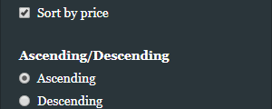
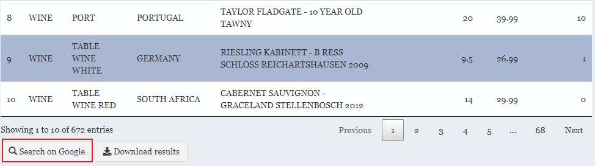
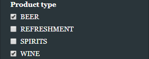

---
output:
  md_document:
    variant: markdown_github
    toc: true
    toc_depth: 4
---

```{r, echo = FALSE}
knitr::opts_chunk$set(
  collapse = TRUE,
  comment = "#>",
  fig.path = "README-"
)
```

# STAT 545A Homework 08 Repo owned by Junbin ZHANG

## Overview

**This is the repository for STAT 545A Homework 08 maintained by Junbin ZHANG.** Welcome!

An shiny app called "BC Liquor store prices" is developed for uesrs to find liquor based on conditions like prices, types, and countries. This app is originally developed by [Dean Attali](https://github.com/daattali/shiny-server/tree/master/bcl), and the data is retrieved from [OpenDataBC](https://www.opendatabc.ca/dataset/bc-liquor-store-product-price-list-current-prices).

**The link for this app is [here](https://junbinzhang.shinyapps.io/junbinzhang-bcl/)**, which is hosted by [shinyapps.io](http://www.shinyapps.io/). This final product is only tested under Google Chrome Version 70.0.3538.102 (64-bit). Due to the limitation of free account of shinyapps.io, if you encounter any issue accessing the above link, please contact me, thank you.

This repo contains the following files:

- Folder ["bcl"](./bcl/) which contains the source code of the shiny app.
  - A ["data"](./bcl/data/) sub-folder for storing data retreived from OpenDataBC, and geometric information to generate map.
  - A ["www"](./bcl/www/) sub-folder for storing images and css.

## Feature implemented

### Feature 1

**Add an option to sort the results table by price.**


A check box is provided to enable the functionality to sort the results table by price. **In addtion, I provide two extra radio boxes to sort the results table by either ascending or descending order.**



### Feature 2

**Add an image of the BC Liquor Store to the UI.**

An `.gif` is added in the welcome tab.


### Feature 3

**Add parameters to the plot.**

In this section, **three sets of parameters are added to the plot.** You can check them under "settings" -> "Appearance" tab.

- Plot type. For the histogram generated, users can choose to plot either Alcohol Content of Price.
- Alpha of bars. To show a clearer results, users can modify this parameter to see overlapping between different types of products.
- Color schemes.
  - Qualitative palettes of RColorBrewer are for users to change the color scheme of the histogram.
  - Sequaential palettes of RColorBrewer are for users to change the color scheme of the map.


### Feature 4

**Place the plot and the table in separate tabs.**

An option is added under "settings" -> "Appearance" tab that allows users to separate plot and table into two different tabs. **In addtion, all the settings are separated into two tabs, namely "Sort & Filter" and "Appearance".**


### Feature 5

**If you know CSS, add CSS to make your app look nicer.**

A simple `custom.css` (which only modifies fonts, logo background color, and padding) is added under folder "www". The following code is used instead of `includeCSS()` because `shinydashboard` (as discussed later) does not support `includeCSS()`.

```{r, eval = FALSE}
tags$head(
  tags$link(rel = "stylesheet", type = "text/css", href = "custom.css")
)
```

### Feature 6

**Experiment with packages that add extra features to Shiny, such as `shinyjs`, `leaflet`, `shinydashboard`, `shinythemes`, `ggvis`.**

In this homework, I implement `shinyjs`, `leaflet` and `shinydashboard`. I skip the other two for the following reasons:

- For `shinythemes`, though it provides many beautiful themes, it is not compatibel to `shinydashboard`.
- For `ggvis`, I decided to stick to `plotly`, because for the interative ways it provides, we can use shiny app's functionalities or `plotly`'s functinalities to replace. I do not notice too many suprises in using `ggvis` compared to `plotly`.

#### Implementation of `shinyjs`

A search button is added under the results table. Once it is clicked, `runjs()` of `shinyjs` is used to open a new window with Google to search the name of a liquor.



#### Implementation of `leaflet`

A map is generated using `leaflet`. It highlights countries that have at least one result, and shows information of number of resultant liquor and average price when users hover on a country.


#### Implementation of `shinydashboard`

The whole application is based on the design of `shinydashboard`. I modified its theme so it may look different to others.

### Feature 7

**When the user wants to see only wines, show a new input that allows the user to filter by sweetness level. Only show this input if wines are selected.**

A slider is added to implement this functionality.


### Feature 8

**If you look at the dataset, you'll see that each product has a "type" (beer, wine, spirit, or refreshment) and also a "subtype" (red wine, rum, cider, etc.). Add an input for "subtype" that will let the user filter for only a specific subtype of products. Since each type has different subtype options, the choices for subtype should get re-generated every time a new type is chosen. For example, if "wine" is selected, then the subtypes available should be white wine, red wine, etc.**

A text input box is added to implement this functionality. In addition, if nothing is specified inside, *all* subtypes are used for generating the final results.



### Notes

The following features are already implemented by Dean Attali, so they are not part of this homework, and they are commented as "originally implemented" in the source code:

- Use the DT package to turn the current results table into an interactive table.
- The app currently behaves strangely when the user selects filters that return 0 results. For example, try searching for wines from Belgium. There will be an empty plot and empty table generated, and there will be a warning message in the R console. Try to figure out why this warning message is appearing, and how to fix it.
- Show the number of results found whenever the filters change. For example, when searching for Italian wines \$20-\$40, the app would show the text "We found 122 options for you".
- Allow the user to download the results table as a `.csv` file.
- Allow the user to search for multiple alcohol types simultaneously, instead of being able to choose only wines/beers/etc.
- Provide a way for the user to show results from *all* countries (instead of forcing a filter by only one specific country).

## References
- [shinydashboard](https://rstudio.github.io/shinydashboard/index.html)
- [Interactive Choropleth Map](https://leafletjs.com/examples/choropleth/)
- [How to plot country-based choropleths using leaflet R](https://stackoverflow.com/questions/44525730/how-to-plot-country-based-choropleths-using-leaflet-r)
- [world.geo.json](https://github.com/johan/world.geo.json)
- [Leaflet for R: Colors](https://rstudio.github.io/leaflet/colors.html)
- [Leaflet for R: Choropleths](https://rstudio.github.io/leaflet/choropleths.html)
- [Create colorful graphs in R with RColorBrewer and Plotly](https://moderndata.plot.ly/create-colorful-graphs-in-r-with-rcolorbrewer-and-plotly/)
- [Direct link to tabItem with R shiny dashboard](https://stackoverflow.com/questions/37169039/direct-link-to-tabitem-with-r-shiny-dashboard)
- [R Shiny: Handle Action Buttons in Data Table](https://stackoverflow.com/questions/45739303/r-shiny-handle-action-buttons-in-data-table)