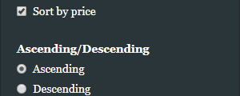
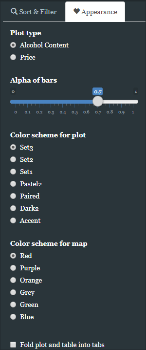
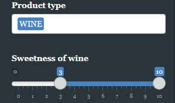

-   [STAT 545A Homework 08 Repo owned by Junbin
    ZHANG](#stat-545a-homework-08-repo-owned-by-junbin-zhang)
    -   [Overview](#overview)
    -   [Feature implemented](#feature-implemented)
        -   [Feature 1](#feature-1)
        -   [Feature 2](#feature-2)
        -   [Feature 3](#feature-3)
        -   [Feature 4](#feature-4)
        -   [Feature 5](#feature-5)
        -   [Feature 6](#feature-6)
            -   [Implementation of
                `leaflet`](#implementation-of-leaflet)
            -   [Implementation of
                `shinydashboard`](#implementation-of-shinydashboard)
        -   [Feature 7](#feature-7)
        -   [Feature 8](#feature-8)
        -   [Notes](#notes)
    -   [References](#references)

STAT 545A Homework 08 Repo owned by Junbin ZHANG
================================================

Overview
--------

**This is the repository for STAT 545A Homework 08 maintained by Junbin
ZHANG.** Welcome!

An shiny app called “BC Liquor store prices” is developed for uesrs to
find liquor based on conditions like prices, types, and countries. This
app is originally developed by [Dean
Attali](https://github.com/daattali/shiny-server/tree/master/bcl), and
the data is retrieved from
[OpenDataBC](https://www.opendatabc.ca/dataset/bc-liquor-store-product-price-list-current-prices).

**The link for this app is
[here](https://junbinzhang.shinyapps.io/junbinzhang-bcl/)**, which is
hosted by [shinyapps.io](http://www.shinyapps.io/). This final product
is only tested under Google Chrome Version 70.0.3538.102 (62-bit). Due
to the limitation of free account of shinyapps.io, if you encounter any
issue accessing the above link, please contact me, thank you.

This repo contains the following files:

-   Folder [“bcl”](./bcl/) which contains the source code of the shiny
    app.
    -   A [“data”](./bcl/data/) sub-folder for storing data retreived
        from OpenDataBC, and geometric information to generate map.
    -   A [“www”](./bcl/www/) sub-folder for storing images and css.

Feature implemented
-------------------

### Feature 1

**Add an option to sort the results table by price.**

A check box is provided to enable the functionality to sort the results
table by price. **In addtion, I provide two extra radio boxes to sort
the results table by either ascending or descending order.**



### Feature 2

**Add an image of the BC Liquor Store to the UI.**

An `.gif` is added in the welcome tab.


### Feature 3

**Add parameters to the plot.**

In this section, **three sets of parameters are added to the plot.** You
can check them under “settings” -&gt; “Appearance” tab.

-   Plot type. For the histogram generated, users can choose to plot
    either Alcohol Content of Price.
-   Alpha of bars. To show a clearer results, users can modify this
    parameter to see overlapping between different types of products.
-   Color scheme. Qualitative palettes of RColorBrewer are selected, so
    users can change the solor scheme of the histogram.



### Feature 4

**Place the plot and the table in separate tabs.**

An option is added under “settings” -&gt; “Appearance” tab that allows
users to separate plot and table into two different tabs. **In addtion,
all the settings are separated into two tabs, namely “Sort & Filter” and
“Appearance”.**


### Feature 5

**If you know CSS, add CSS to make your app look nicer.**

A simple `custom.css` (which only modifies fonts, logo background color,
and padding) is added under folder “www”. The following code is used
instead of `includeCSS()` because `shinydashboard` (as discussed later)
does not support `includeCSS()`.

``` r
tags$head(
  tags$link(rel = "stylesheet", type = "text/css", href = "custom.css")
)
```

### Feature 6

**Experiment with packages that add extra features to Shiny, such as
`shinyjs`, `leaflet`, `shinydashboard`, `shinythemes`, `ggvis`.**

In this homework, I implement `leaflet` and `shinydashboard`. I skip the
other three for the following reasons:

-   For `shinyjs`, the only idea I can think of is to pop up some alert
    messages. However, they somehow provide bad user experiences, so I
    decide not to use it.
-   For `shinythemes`, though it provides many beautiful themes, it is
    not compatibel to `shinydashboard`.
-   For `ggvis`, I decided to stick to `plotly`, because for the
    interative ways it provides, we can use shiny app’s functionalities
    or `plotly`’s functinalities to replace. I do not notice too many
    suprises in using `ggvis` compared to `plotly`.

#### Implementation of `leaflet`

A map is generated using `leaflet`. It highlights countries that have at
least one result, and shows information of number of resultant liquor
and average price when users hover on a country.


#### Implementation of `shinydashboard`

The whole application is based on the design of `shinydashboard`. I
modified its theme so it may look different to others.

### Feature 7

**When the user wants to see only wines, show a new input that allows
the user to filter by sweetness level. Only show this input if wines are
selected.**

A slider is added to implement this functionality.



### Feature 8

**If you look at the dataset, you’ll see that each product has a “type”
(beer, wine, spirit, or refreshment) and also a “subtype” (red wine,
rum, cider, etc.). Add an input for “subtype” that will let the user
filter for only a specific subtype of products. Since each type has
different subtype options, the choices for subtype should get
re-generated every time a new type is chosen. For example, if “wine” is
selected, then the subtypes available should be white wine, red wine,
etc.**

A text input box is added to implement this functionality. In addition,
if nothing is specified inside, *all* subtypes are used for generating
the final results.


### Notes

The following features are already implemented by Dean Attali, so they
are not part of this homework, and they are commented as “originally
implemented” in the source code:

-   Use the DT package to turn the current results table into an
    interactive table.
-   The app currently behaves strangely when the user selects filters
    that return 0 results. For example, try searching for wines from
    Belgium. There will be an empty plot and empty table generated, and
    there will be a warning message in the R console. Try to figure out
    why this warning message is appearing, and how to fix it.
-   Show the number of results found whenever the filters change. For
    example, when searching for Italian wines $20-$40, the app would
    show the text “We found 122 options for you”.
-   Allow the user to download the results table as a `.csv` file.
-   Allow the user to search for multiple alcohol types simultaneously,
    instead of being able to choose only wines/beers/etc.
-   Provide a way for the user to show results from *all* countries
    (instead of forcing a filter by only one specific country).

References
----------

-   [shinydashboard](https://rstudio.github.io/shinydashboard/index.html)
-   [Interactive Choropleth
    Map](https://leafletjs.com/examples/choropleth/)
-   [How to plot country-based choropleths using leaflet
    R](https://stackoverflow.com/questions/44525730/how-to-plot-country-based-choropleths-using-leaflet-r)
-   [world.geo.json](https://github.com/johan/world.geo.json)
-   [Leaflet for R:
    Colors](https://rstudio.github.io/leaflet/colors.html)
-   [Leaflet for R:
    Choropleths](https://rstudio.github.io/leaflet/choropleths.html)
-   [Create colorful graphs in R with RColorBrewer and
    Plotly](https://moderndata.plot.ly/create-colorful-graphs-in-r-with-rcolorbrewer-and-plotly/)
